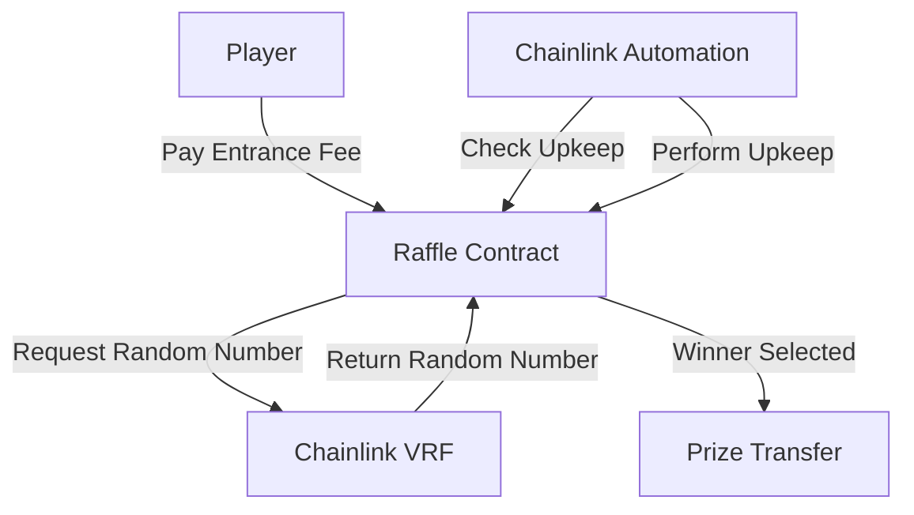

# 🎲 Decentralized Raffle Contract

A provably fair, decentralized raffle system built on Ethereum using Chainlink VRF for secure randomness and Chainlink Automation for automated execution.

## 📋 Table of Contents

- [Overview](#overview)
- [Features](#features)
- [Architecture](#architecture)
- [Prerequisites](#prerequisites)
- [Installation](#installation)
- [Deployment](#deployment)
- [Usage](#usage)
- [Contract Interface](#contract-interface)
- [Security Considerations](#security-considerations)
- [Testing](#testing)
- [Gas Optimization](#gas-optimization)
- [Troubleshooting](#troubleshooting)
- [Contributing](#contributing)
- [License](#license)

## 🎯 Overview

The Raffle contract implements a trustless lottery system where players can enter by paying an entrance fee, and winners are selected using verifiable random numbers from Chainlink VRF. The entire process is automated using Chainlink Automation, ensuring fair and timely execution without human intervention.

### Key Components

- **Smart Contract**: Handles player entries, fee collection, and prize distribution
- **Chainlink VRF**: Provides cryptographically secure randomness for winner selection
- **Chainlink Automation**: Automatically triggers raffle draws at specified intervals

## ✨ Features

- 🔒 **Provably Fair**: Uses Chainlink VRF for verifiable randomness
- 🤖 **Fully Automated**: Chainlink Automation handles execution
- 💰 **Transparent**: All transactions recorded on-chain
- ⚡ **Gas Efficient**: Optimized for minimal gas consumption
- 🛡️ **Secure**: Comprehensive error handling and security measures
- 📊 **Observable**: Rich event emission for tracking

## 🏗️ Architecture



### Contract Inheritance

```
Raffle
├── VRFConsumerBaseV2Plus (Chainlink VRF integration)
└── AutomationCompatibleInterface (Chainlink Automation integration)
```

## 📋 Prerequisites

- Node.js >= 22.0.0
- npm or yarn
- Hardhat or Foundry
- Chainlink VRF subscription
- Chainlink Automation registration

## 🚀 Installation

1. **Clone the repository**

   ```bash
   git clone https://github.com/yourusername/decentralized-raffle.git
   cd decentralized-raffle
   ```

2. **Install dependencies**

   ```bash
   npm install
   # or
   yarn install
   ```

3. **Set up environment variables**

   ```bash
   cp .env.example .env
   # Edit .env with your values
   ```

4. **Required Environment Variables**
   ```env
   PRIVATE_KEY=your_private_key_here
   SEPOLIA_RPC_URL=your_sepolia_rpc_url
   ETHERSCAN_API_KEY=your_etherscan_api_key
   VRF_SUBSCRIPTION_ID=your_vrf_subscription_id
   VRF_COORDINATOR=0x... # Network-specific VRF Coordinator address
   KEY_HASH=0x... # Network-specific key hash
   ```

## 📦 Deployment

### 1. Deploy to Sepolia Testnet

```bash
npx hardhat run scripts/deploy.js --network sepolia
```

### 2. Verify Contract

```bash
npx hardhat verify --network sepolia DEPLOYED_CONTRACT_ADDRESS "constructor_args"
```

### 3. Setup Chainlink Services

#### VRF Subscription:

1. Visit [Chainlink VRF](https://vrf.chain.link/)
2. Create a subscription
3. Add your contract as a consumer
4. Fund with LINK tokens

#### Automation Setup:

1. Visit [Chainlink Automation](https://automation.chain.link/)
2. Register new upkeep
3. Set your contract address
4. Fund with LINK tokens

## 🎮 Usage

### For Players

1. **Enter Raffle**

   ```javascript
   // Web3.js example
   await raffleContract.methods.enterRaffle().send({
     from: playerAddress,
     value: entranceFee,
   });
   ```

2. **Check Current Players**

   ```javascript
   const players = await raffleContract.methods.getPlayers().call();
   console.log(`Current players: ${players.length}`);
   ```

3. **Get Raffle Info**
   ```javascript
   const entranceFee = await raffleContract.methods.getEntranceFee().call();
   const raffleState = await raffleContract.methods.getRaffleState().call();
   const recentWinner = await raffleContract.methods.getRecentWinner().call();
   ```

### For Developers

#### Monitoring Events

```javascript
// Listen for player entries
raffleContract.events.Raffle__PlayerEnter(
  {
    fromBlock: "latest",
  },
  (error, event) => {
    if (error) console.error(error);
    console.log(`New player entered: ${event.returnValues.player}`);
  }
);

// Listen for winners
raffleContract.events.Raffle__PlayerWinner(
  {
    fromBlock: "latest",
  },
  (error, event) => {
    if (error) console.error(error);
    console.log(`Winner selected: ${event.returnValues.player}`);
  }
);
```

## 📖 Contract Interface

### Constructor Parameters

| Parameter          | Type    | Description                       |
| ------------------ | ------- | --------------------------------- |
| `entranceFee`      | uint256 | Minimum fee to enter raffle (wei) |
| `interval`         | uint256 | Time between raffles (seconds)    |
| `vrfCoordinator`   | address | Chainlink VRF Coordinator address |
| `keyHash`          | bytes32 | VRF key hash for gas price tier   |
| `subscriptionId`   | uint64  | VRF subscription ID               |
| `callbackGasLimit` | uint32  | Gas limit for VRF callback        |

### Main Functions

#### Public Functions

- `enterRaffle() payable` - Enter the raffle by paying entrance fee
- `checkUpkeep(bytes) → (bool, bytes)` - Check if upkeep is needed
- `performUpkeep(bytes)` - Perform upkeep (trigger winner selection)

#### View Functions

- `getEntranceFee() → uint256` - Get entrance fee
- `getInterval() → uint256` - Get raffle interval
- `getRecentWinner() → address` - Get last winner
- `getPlayers() → address[]` - Get current players
- `getRaffleState() → RaffleState` - Get raffle state
- `getNextInterval() → uint256` - Get next raffle timestamp

### Events

```solidity
event Raffle__PlayerEnter(address indexed player);
event Raffle__PlayerWinner(address indexed player);
```

### Custom Errors

```solidity
error Raffle__NotEnoughEthSent();
error Raffle__TransferFailed();
error Raffle__RaffleNotOpen();
error Raffle__UpkeepNotNeeded(uint256, uint256, RaffleState);
```

## 🔒 Security Considerations

### Implemented Security Measures

1. **Reentrancy Protection**: Uses checks-effects-interactions pattern
2. **Access Control**: Proper function visibility and state management
3. **Input Validation**: Comprehensive error handling for invalid inputs
4. **Randomness**: Chainlink VRF ensures unpredictable random numbers
5. **Automation Security**: Upkeep checks prevent unauthorized execution

### Best Practices

- Always check return values of external calls
- Use pull payment pattern for prize distribution
- Implement circuit breakers for emergency situations
- Regular security audits recommended for production

### Known Limitations

- Contract owner cannot influence winner selection
- VRF requests can fail (handled gracefully)
- Gas price fluctuations may affect callback execution

## 🧪 Testing

### Run Test Suite

```bash
# Run all tests
npx hardhat test

# Run with coverage
npx hardhat coverage

# Run specific test file
npx hardhat test test/raffle.test.js
```

### Test Categories

1. **Unit Tests**: Individual function testing
2. **Integration Tests**: VRF and Automation interaction
3. **Gas Tests**: Gas consumption analysis
4. **Edge Cases**: Boundary condition testing

### Sample Test Output

```bash
✅ Raffle Contract
  ✅ Constructor
    ✅ Sets entrance fee correctly
    ✅ Sets interval correctly
    ✅ Initializes raffle state as OPEN
  ✅ Enter Raffle
    ✅ Allows players to enter with correct fee
    ✅ Reverts with insufficient fee
    ✅ Reverts when raffle is calculating
  ✅ Automation
    ✅ Returns false when conditions not met
    ✅ Returns true when all conditions met
    ✅ Performs upkeep correctly
```

## ⚡ Gas Optimization

### Optimization Techniques Used

1. **Immutable Variables**: Constructor parameters stored as immutable
2. **Packed Structs**: Efficient storage layout
3. **Custom Errors**: Instead of string revert messages
4. **Event Indexing**: Strategic use of indexed parameters

### Gas Usage (Estimated)

| Function          | Gas Cost       |
| ----------------- | -------------- |
| `enterRaffle()`   | ~50,000        |
| `performUpkeep()` | ~100,000       |
| `checkUpkeep()`   | ~30,000 (view) |

## 🐛 Troubleshooting

### Common Issues

#### VRF Request Fails

```bash
Error: VRF request failed
```

**Solution**: Ensure VRF subscription has sufficient LINK balance

#### Automation Not Triggering

```bash
Error: Upkeep not performed
```

**Solution**: Check Automation registration and LINK balance

#### Transaction Reverts

```bash
Error: Raffle__NotEnoughEthSent()
```

**Solution**: Send exact or higher entrance fee

### Debug Commands

```bash
# Check contract state
npx hardhat console --network sepolia
> const raffle = await ethers.getContractAt("Raffle", "CONTRACT_ADDRESS")
> await raffle.getRaffleState()

# Check upkeep status
> await raffle.checkUpkeep("0x")
```

## 🤝 Contributing

We welcome contributions! Please see our [Contributing Guidelines](CONTRIBUTING.md).

### Development Setup

1. Fork the repository
2. Create a feature branch
3. Make your changes
4. Add tests
5. Submit a pull request

### Code Style

- Use Prettier for formatting
- Follow Solidity style guide
- Add comprehensive NatSpec comments
- Include unit tests for new features

## 📄 License

This project is licensed under the MIT License - see the [LICENSE](LICENSE) file for details.

## 📞 Support

- **Documentation**: [docs.example.com](https://docs.example.com)
- **Discord**: [Join our community](https://discord.gg/example)
- **Issues**: [GitHub Issues](https://github.com/yourusername/decentralized-raffle/issues)
- **Email**: support@example.com

## 🙏 Acknowledgments

- [Chainlink](https://chain.link/) for VRF and Automation services
- [OpenZeppelin](https://openzeppelin.com/) for security best practices
- [Hardhat](https://hardhat.org/) for development framework

---

**⚠️ Disclaimer**: This contract is for educational purposes. Please conduct thorough testing and security audits before using in production.
